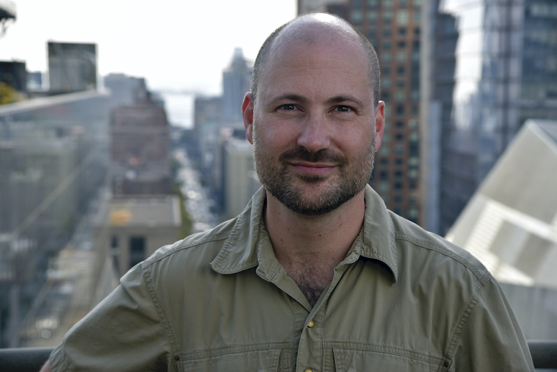

```{r setup, include=FALSE}
knitr::opts_chunk$set(echo = FALSE)
```


# Before we get started:

* Make sure you have R open, and the working directory set to where you put the files we sent out

  * If you are in RStudio, you can just open the project file

--

* The following packages should be installed:

  * gratia (for visualizing GAMs)
  * DHARMa (for assessing model fit)
  * lme4 (will be used in day 3)
  * gamm4 (will be used in day 3)

---


# Before we get started:

* If you weren't able to get everything set up on your computer, you can use this online instance: https://mybinder.org/v2/gh/pedersen-fisheries-lab/DFO-3day-gam-workshop/master?urlpath=rstudio. We won't really be able to trouble-shoot it though. 

* If you use the Binder instance: make sure you save your work outside the notebook, as when you close your window or go away from your computer, the instance will reset to the original state of the Github repository. 
---

# Who we are


.left-column[ 
```{r}
knitr::include_graphics("figures/epedersen.jpg")

```

<br/>
----------------------------
```{r}


```
]

.right-column[
.small[Eric Pedersen is an assistant professor at Concordia University in Montreal. He studies rapid change in aquatic ecosystems, and developing methods for monitoring spatially structured communities]
<br/>
----------------------------

.small[Dave Miller is a research fellow at the Centre for Research into Ecological & Environmental Modelling and the School of Maths and Stats at the University of St Andrews. He primarily works on methods and software for animal abundance estimation, using GAMs wherever possible.]

]


---

# Who we are


.left-column[ 

<br/>
```{r}


```

<br/>
<br/>
----------------------------
```{r}
knitr::include_graphics("figures/gavin.jpg")

```
]

.right-column[

.small[Noam Ross is Principal Scientist for Computational Research at EcoHealth Alliance, a nonprofit working at the intersection of conservation and human health. He uses GAMs and other tools to study the distribution and dynamics of diseases in wildlife and predict the spillover of pathogens from animals to humans.]


----------------------------

.small[Gavin Simpson is Quantitative Environmental Scientist at the Institute of Environmental Change and Society (ICS) at the University of Regina. His research interests include dynamical systems ecology and abrupt ecological change, climate change effects on arctic lakes, and paleolimnology.]

]


---


# How we'll be running the workshop:

* Six sessions over 3 days

--

* Each session will include:

  * A short presentation on theory
  * Live coding
  * Exercises

--


* There's an hour break between sessions. We'll start promptly after the break, so please make sure you're back in a few minutes early.

--

* Our presentation will be recorded, and we'll provide answers to the exercises after each day

---


# How we'll be running the workshop:


**Day 1 (Wednesday): What's a GAM?** 

  * Morning: Intro to GAM theory [Eric]

  * Afternoon: Digging deeper into GAMS [David]

--

**Day 2 (Thursday): So you have a GAM: now what? **

  * Morning: Model checking and selection [Noam]
  
  * Afternoon: Predictions and model uncertainty [Gavin]

--

**Day 3 (Friday): Q&A, Advanced GAM tools**

  * Morning: Q&A, and connections between GAMs and other approaches [David]
  
  * Afternoon: Advanced GAM usage [Eric]

---


# How we'll be running the workshop:


* Because of the number of participants, the presenter won't be able to answer questions directly

--

* The other team members will be monitoring the chat channel here, and the four conversations in the GAMs team; they'll try to answer your question, or bring it up between segments so the whole group can hear the answer

---


# How we'll be running the workshop:


.pull-left[

* If you just want to chat with other participants, you can write in the meeting chat.

* If you want to ask a question, or are having a technical issue, please use one of the five channels in the GAMs team. 


]

.pull-right[
```{r, fig.height=4}

```


```{r, fig.height=5}

```
]


---

# Now on to the workshop! 