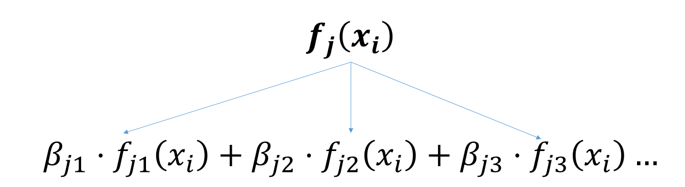

```{r setup, include=FALSE}
knitr::opts_chunk$set(echo = FALSE)
#knitr::opts_knit$set(root.dir = usethis::proj_path())

library('here')
library('mgcv')
library('gratia')
library('gamair')
library('ggplot2')
library('purrr')
library('mvnfast')
library("tibble")
library('gganimate')
library('cowplot')
library('tidyr')
library("knitr")
library("viridis")
library('readr')
library('dplyr')
library('gganimate')
library('transformr')
library('patchwork')

opts_chunk$set(cache=TRUE, echo=FALSE)
```


## Overview

- A very quick refresher on GLMs
- What is a GAM?
- How do GAMs work? (*Roughly*)
- What is smoothing?
- Fitting and plotting simple models

---
# A (very fast) refresher on GLMs

---

##  What is a Generalized Linear model (GLM)?

Models that look like:

$y_i \sim Some\ distribution(\mu_i, \sigma_i)$

$link(\mu_i) = Intercept + \beta_1\cdot x_{1i} + \beta_1\cdot x_{2i} + \ldots$

---

##  What is a Generalized Linear model (GLM)?

Models that look like:

$y_i \sim Some\ distribution(\mu_i, \sigma_i)$

$link(\mu_i) = Intercept + \beta_1\cdot x_{1i} + \beta_1\cdot x_{2i} + \ldots$

  <br />

 The average value of the response, $\mu_i$, assumed to be a linear combination of the covariates, $x_{ji}$, with an offset
---

##  What is a Generalized Linear model (GLM)?

Models that look like:

$y_i \sim Some\ distribution(\mu_i, \sigma_i)$

$link(\mu_i) = Intercept + \beta_1\cdot x_{1i} + \beta_1\cdot x_{2i} + \ldots$

  <br />

 The model is fit (not really...) by maximizing the log-likelihood:


$\text{maximize}  \sum_{i=1}^n logLik (Some\ distribution(y_i))$

$\text{ with respect to } Intercept, \ \beta_1,\ \beta_2, \ ...$

---
##  With normally distributed data (for continuous unbounded data):


$y_i = Normal(\mu_i , \sigma_i)$

$Identity(\mu_i) = Intercept + \beta_1\cdot x_{1i} + \beta_1\cdot x_{2i} + \ldots$

```{r gaussplot, fig.width=12, fig.height=6}
set.seed(2) ## simulate some data...
dat <- tibble(x = seq(0,1, length = 100),
              y = rnorm(100, 3*x+2, 0.5))

mod <- glm(y~x, data= dat, family=gaussian)

p <- ggplot(dat,aes(y=y,x=x)) +
  geom_point() +
  geom_smooth(method= glm,formula=y~x, method.args=list(family = "gaussian"))+
  labs(title= paste0("True: Identity(mu) = 2 + 3*x, sigma = 0.5\n",
                     "Estimated: Identity(mu) = ",
                     round(coef(mod)[[1]],1)," + ",
                     round(coef(mod)[[2]],1),"*x, sigma = ",
                     round(summary(mod)$dispersion,2)))+
  theme_minimal(base_size = 20)
  
print(p)
```

---

##  With Poisson-distributed data (for count data):

$y_i = Poisson(\mu_i)$

$\mu_i = Intercept + \beta_1\cdot x_{1i} + \beta_1\cdot x_{2i} + \ldots$

```{r poisplot, fig.width=12, fig.height=6}
set.seed(2) ## simulate some data...
dat <- tibble(x = seq(0,1, length = 100),
              y = rpois(100, exp(3*x+2)))

mod <- glm(y~x, data= dat, family= poisson(link ="log"))

p <- ggplot(dat,aes(y=y,x=x)) +
  geom_point() +
  geom_smooth(method= glm,formula=y~x, method.args=list(family = "poisson"))+
  labs(title= paste0("True: ln(mu) = 2 + 3*x\n",
                     "Estimated: ln(mu) = ",
                     round(coef(mod)[[1]],1)," + ",
                     round(coef(mod)[[2]],1),"*x"))+
  theme_minimal(base_size = 20)
  
print(p)
```

---

# Why bother with anything more complicated?

---

## Is this linear?


```{r islinear, fig.width=12, fig.height=6}
set.seed(2) ## simulate some data...
dat <- gamSim(1, n=400, dist="normal", scale=0.2, verbose=FALSE)
dat <- dat[,c("y", "x0", "x1", "x2", "x3")]
p <- ggplot(dat,aes(y=y,x=x1)) +
      geom_point() +
      theme_minimal(base_size = 20)
print(p)
```

---

## Is this linear? Maybe?


```{r eval=FALSE, echo=TRUE}
lm(y ~ x1, data=dat)
```


```{r maybe, fig.width=12, fig.height=6}
p <- ggplot(dat, aes(y=y, x=x1)) + 
  geom_point() +
  theme_minimal(base_size = 20)

print(p + geom_smooth(method="lm"))
```


---

# What is a GAM?


The Generalized additive model assumes that $link(\mu_i)$ is the sum of some *nonlinear* functions of the covariates

$y_i \sim Some\ distribution(\mu_i, \sigma_i)$

$link(\mu_i) = Intercept + f_1(x_{1i}) + f_2(x_{2i}) + \ldots$

  <br />

--

But it is much easier to fit *linear* functions than nonlinear functions, so GAMs use a trick: 

1. Transform each predictor variable into several new variables, called basis functions
2. Create nonlinear functions as linear sums of those basis functions


---


```{r,fig.width=5}

```

```{r basis-plot, message=FALSE, warning=FALSE,fig.width=12,fig.height=5}

dat <- tibble(x = seq(0, 1, length=50))
bases <-  as.matrix(smoothCon(s(x, k = 6),data = dat,knots = NULL,absorb.cons = TRUE)[[1]]$X)

basis_simple <- dat %>%
  bind_cols(as.tibble(bases))%>%
  gather(key = `basis function`,value =value, -x)


p <- ggplot(basis_simple, aes(x, value, group = `basis function`, color = factor(`basis function`))) +
  geom_line() + 
  geom_hline(yintercept = 0,lty=2)+
  scale_color_brewer("Basis function",palette = "Set1") +
  theme_minimal(base_size = 20)+
  theme(panel.grid = element_blank())
p

```

---

```{r basis-animate, message=FALSE, warning=FALSE,cache=TRUE,fig.width=12}
basis_transition <- list()
basis_ends <- list()


set.seed(3)

for(i in 1:10){
  coef <- rnorm(5)
  current_basis <- bases%*%diag(coef) %>%
    as.tibble()
  
  max_vals <- current_basis[50,]
  max_vals <- unlist(max_vals)
  
  current_basis$total  <- rowSums(current_basis)
  
  current_basis <- bind_cols(dat, current_basis)%>%
    gather(key = `basis function`,value =value, -x, -total)
  current_basis$sim <- i
  basis_transition[[i]] <- current_basis
  
  basis_ends[[i]] <- tibble(x = 1.05,
                            value = max_vals,
                            `basis function` = paste0("V", 1:5),
                            label = paste(`basis function`, "*", round(coef,2)),
                            sim = i
                            )
}

basis_transition <- bind_rows(basis_transition)
basis_ends <- bind_rows(basis_ends)

p <- ggplot(basis_transition, 
            aes(x, value, group = `basis function`, color = factor(`basis function`))) +
  geom_line() +
  geom_line(aes(y=total),color= "black",size=2)+
  geom_hline(yintercept = 0,lty=2)+
  geom_text(data=basis_ends, aes(label = label), show.legend = F)+
  scale_color_brewer("Basis function",palette = "Set1") +
  theme_minimal(base_size = 20)+
  theme(panel.grid = element_blank()) +
  transition_states(sim,
                    transition_length = 2,
                    state_length = 2)
p
```

---

#This means that writing a GAM in code is as simple as:

```{r echo=TRUE, eval=FALSE}
mod <- gam(y~s(x,k=10),data=dat)
```

---


# You've seen basis functions before:


```{r eval = FALSE,include=TRUE,echo=TRUE}

glm(y ~ I(x) + I(x^2) + I(x^2) +...)

```

--

Polynomials are one type of basis function! 

--

... But not a good one. 


```{r , message=FALSE, warning=FALSE,cache=TRUE,fig.width=12,fig.height=5}

set.seed(2)
dat <- tibble(x = seq(-10,10, length=50),
       y = plogis(x,scale = 1)+rnorm(50,mean = 0,sd = 0.1))%>%
    mutate(y = ifelse(between(x,4,8)|between(x,-10,-9),NA,y))
for(i in 2:6){
  dat[,paste0("degree=",i)] = predict(glm(y~poly(x,i),data=dat,
                                          na.action = na.exclude),newdata = dat)
}
dat <- dat %>%
  gather(key = degree,value= value,-x,-y)

p <- ggplot(dat, aes(x,y))+
  geom_point()+
  geom_line(aes(y=value, group=degree))+
  theme_minimal(base_size = 20)+
  transition_states(degree,
                    transition_length = 0,
                    state_length = 0.5)+
  ggtitle('{closest_state}')

p

```

---

# One of the most common types of smoother are cubic splines


(We won't get into the details about how these are defined)

```{r eval = FALSE,include=TRUE,echo=TRUE}

glm(y ~ ns(x,df = 4))

```

--

But even cubic splines can overfit:

```{r , message=FALSE, warning=FALSE,cache=TRUE,fig.width=12,fig.height=5}

set.seed(2)

dat <- tibble(x = seq(-10,10, length=50),
       y = plogis(x,scale = 1)+rnorm(50,mean = 0,sd = 0.1))%>%
    mutate(y = ifelse(between(x,4,8)|between(x,-10,-9),NA,y))
  dat[,paste0("degree=",10)] = predict(glm(y~splines::ns(x,df = 10),data=dat,
                                          na.action = na.exclude),newdata = dat)
dat <- dat %>%
  gather(key = degree,value= value,-x,-y)

p <- ggplot(dat, aes(x,y))+
  geom_point()+
  geom_line(aes(y=value, group=degree))+
  theme_minimal(base_size = 20)+
  labs(title = "Cubic spline, 10 deegrees of freedom")

p

```


---


# How do we prevent overfitting?

The second key part of fitting GAMs: penalizing overly wiggly functions

We want functions that fit our data well, but do not overfit: that is, ones that are not too *wiggly*. 


--

Remember from before:


$\text{maximize}  \sum_{i=1}^n logLik (y_i)$

$\text{ with respect to } Intercept, \ \beta_1,\ \beta_2, \ ...$

---


# How do we prevent overfitting?

The second key part of fitting GAMs: penalizing overly wiggly functions

We want functions that fit our data well, but do not overfit: that is, ones that are not too *wiggly*. 


We can modify this to add a *penalty* on the size of the model parameters:


$\text{maximize}  \sum_{i=1}^n logLik (y_i) - \lambda\cdot \mathbf{\beta}'\mathbf{S}\mathbf{\beta}$

$= \text{maximize}  \sum_{i=1}^n logLik (y_i) - \lambda\cdot \sum_{a=1}^{k}\sum_{b=1}^k \beta_a\cdot\beta_b\cdot P_{a,b}$

$\text{ with respect to } Intercept, \ \beta_1,\ \beta_2, \ ...$


---

# How do we prevent overfitting?

The penalty $\lambda$ trades off between how well the model fits the observed data ( $\sum_{i=1}^n logLik (y_i)$ ), and how wiggly the fitted function is ( $\mathbf{\beta}'\mathbf{S}\mathbf{\beta}$ ). 

The matrix $\mathbf{S}$ measures how wiggly different function shapes are 

---

# For instance, for smoothing splines:

We can create a penalty matrix that penalizes the squared second derivative:

$\int_{x_1}^{x_n} [f^{\prime\prime}]^2 dx = \boldsymbol{\beta}^{\mathsf{T}}\mathbf{S}\boldsymbol{\beta}$


--

```{r pen-plot, message=FALSE, warning=FALSE,fig.width=12,fig.height=5}

dat <- tibble(x = seq(0, 1, length=50))
bases <-  as.matrix(smoothCon(s(x, k = 6),data = dat,knots = NULL,absorb.cons = TRUE)[[1]]$X)

pen_mat <- smoothCon(s(x, k = 6),data = dat,knots = NULL,absorb.cons = TRUE)[[1]]$S[[1]] 

pen_df <- pen_mat %>%
  as.data.frame()%>%
  cbind(basis_x = paste0("V",1:5))%>%
  as.tibble()%>%
  gather(key=basis_y, value = value,-basis_x)


basis_simple <- dat %>%
  bind_cols(as.tibble(bases))%>%
  gather(key = `basis function`,value =value, -x)


p <- ggplot(basis_simple, aes(x, value, group = `basis function`, color = factor(`basis function`))) +
  geom_line() + 
  geom_hline(yintercept = 0,lty=2)+
  scale_color_brewer("Basis function",palette = "Set1") +
  theme_minimal(base_size = 20)+
  theme(panel.grid = element_blank(),
        legend.position = "bottom")

S <- ggplot(pen_df, aes(basis_x, reorder(basis_y,desc(basis_y)), fill  =value)) +
  geom_tile(color="black")+
  scale_fill_gradient2("penalty value", low="blue",high="red")+
  labs(x= NULL,y=NULL)+
  theme_minimal(base_size = 20)+
  theme(panel.grid = element_blank(),
        legend.position = "bottom")+
  coord_equal()

p + S

```

---


```{r pen-ani1, message=FALSE,cache=TRUE, warning=FALSE,fig.width=12,fig.height=5 }
S

```

```{r pen-ani2, message=FALSE,cache=TRUE, warning=FALSE,fig.width=12,fig.height=5 }
basis_transition <- list()
basis_ends <- list()


set.seed(3)

for(i in 1:5){
  coef <- rep(0,times=5)
  coef[i] = 1
  current_basis <- bases%*%diag(coef) %>%
    as.tibble()
  
  current_pen <- (t(coef) %*% pen_mat %*% coef)[1,1]
  
  max_vals <- current_basis[50,]
  max_vals <- unlist(max_vals)
  
  current_basis$total  <- rowSums(current_basis)
  
  current_basis <- bind_cols(dat, current_basis)%>%
    gather(key = `basis function`,value =value, -x, -total)
  current_basis$sim <- i
  
  current_basis$`total penalty` = paste0("Penalty = ",round(current_pen,1))
  
  basis_transition[[i]] <- current_basis
  
  basis_ends[[i]] <- tibble(x = 1.05,
                            value = max_vals,
                            `basis function` = paste0("V", 1:5),
                            label = `basis function`,
                            sim = i
                            )
}

basis_transition <- bind_rows(basis_transition)
basis_ends <- bind_rows(basis_ends)

p <- ggplot(basis_transition, 
            aes(x, value, group = `basis function`, color = factor(`basis function`))) +
  geom_line() +
  geom_line(aes(y=total),color= "black",size=2)+
  geom_hline(yintercept = 0,lty=2)+
  geom_text(aes(label = `total penalty`), x= 0.5, y= 1,size=10,color="black", show.legend = F) +
  geom_text(data=basis_ends, aes(label = label), show.legend = F)+
  scale_color_brewer("Basis function",palette = "Set1") +
  theme_minimal(base_size = 20)+
  theme(panel.grid = element_blank()) +
  transition_states(sim,
                    transition_length = 2,
                    state_length = 2)
p
```


---

# You've also (probably) already seen penalties before:

Single-level random effects are another type of smoother!

```{r}

```

---

# You've also (probably) already seen penalties before:

Single-level random effects are another type of smoother!

You've probably seen random effects written like: 

$y_{i,j} =\alpha + \beta_j + \epsilon_i$, $\beta_i \sim Normal(0, \sigma_{\beta}^2)$

--

* The basis functions are the different levels of the discrete variable: $f_j(x_i)=1$ if $x_i$ is in group $j$, $f_j(x_i)=1$ if not

* The  $\beta_j$ terms are the parameters the basis functions are being scaled by


* The variance of the random effect is equal to $1/\lambda$, so the $S$ matrix for a random effect is just a diagonal matrix with $1/\sigma^2$ on the diagonal


---

# How are the $\lambda$ penalties fit?

* By default, `mgcv` uses Generalized Cross-Validation, but this tends to work well only with really large data sets

* We will use restricted maximum likelihood (REML) throughout this workshop for fitting GAMs

* This is the same REML you may have used when fitting random effects models; again, smoothers in GAMs are basically a random effect in a different hat


---

# To review:

* GAMs are like GLMs: they use link functions and likelihoods to model different types of data

--

* GAMs use linear combinations of basis functions to create nonlinear functions to predict data

--

* GAMs use penalty parameters, $\lambda$, to prevent overfitting the data; this trades off between how wiggly the function is and how well it fits the data 
(measured by the likelihood)


--

* the penalty matrix for a given smooth, $\textbf{S}$, encodes how the shape of the function translates into the total size of the penalty

--

# But enough lecture; on to the live coding! 


