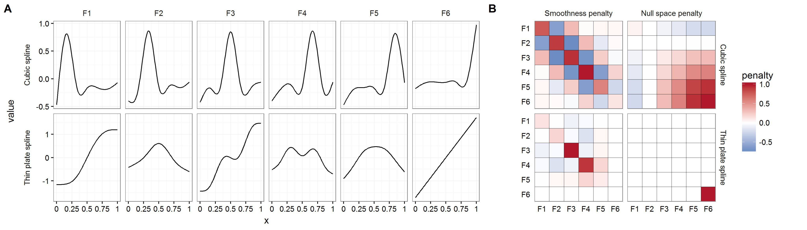

class: inverse middle center big-subsection

```{r setup, include=FALSE, cache=FALSE}
options(htmltools.dir.version = FALSE)
knitr::opts_chunk$set(cache = TRUE, dev = 'svg', echo = TRUE, message = FALSE, warning = FALSE,
                      fig.height=6, fig.width = 1.777777*6)
library('here')
library('mgcv')
library('gratia')
library('gamair')
library('ggplot2')
library('purrr')
library('mvnfast')
library("tibble")
library('gganimate')
library('cowplot')
library('tidyr')
library("knitr")
library("viridis")
library('readr')
library('dplyr')
library('gganimate')
library('xaringan')
## plot defaults
theme_set(theme_minimal(base_size = 16, base_family = 'Fira Sans'))
## constants
anim_width <- 1000
anim_height <- anim_width / 1.77777777
anim_dev <- 'png'
anim_res <- 200
```

# Good Morning!

---

# Logistics

## Today:

-  Morning: Model Checking and Variable Selecton with Me
-  Afternoon: Prediction and Variation with Gavin

## Reminder

-  Links seminar materials in the "Workshops Material" channel
-  Ask questions in the "General" Channel
-  Software problems? Use the online RStudio instance: [bit.ly/gam-rstudio](https://bit.ly/gam-rstudio)

---

# Review

.pull-left[
- Basis Functions
- Penalization
- Smooths with `s()`, `te()`, and `ti()` many distributions!

```{r shrimpmod}
shrimp <- read.csv(here("data/trawl_nl.csv"))
shrimp2010 <- subset(shrimp, year==2010)
b_shrimp <- 
  gam(shrimp ~ 
        offset(log(area_trawled))
        + s(x, y),
      data=shrimp2010,
      family=quasipoisson,
      method="REML")
```
]

.pull-right[
```{r plot-effect, fig.height=6, fig.width = 6, echo = TRUE}
plot(b_shrimp, scheme = 2, asp=1)
```
]

---
class: inverse middle center subsection

# Model checking


---

# Are predictions or inference any good?

Only if model specification matches the data-generating process

```{r misspecify, echo = FALSE}
set.seed(15)
model_list = c("right model", 
               "wrong distribution",
               "heteroskedasticity",
               "dependent data",
               "wrong functional form",
               "over-smoothed")
n <- 60
sigma=1
x <- seq(-1,1, length=n)
model_data <- as.data.frame(expand.grid( x=x,model=model_list))
model_data$y <- 5*model_data$x^2 + 2*model_data$x
for(i in model_list){
  if(i %in% c("right model", "over-smoothed")){
    model_data[model_data$model==i, "y"] <- model_data[model_data$model==i, "y"]+ 
      rnorm(n,0, sigma)
  } else if(i == "wrong distribution"){
    model_data[model_data$model==i, "y"] <- model_data[model_data$model==i, "y"]+ 
      rt(n,df = 3)*sigma
  } else if(i == "heteroskedasticity"){
    model_data[model_data$model==i, "y"] <- model_data[model_data$model==i, "y"]+  
      rnorm(n,0, sigma*10^(model_data[model_data$model==i, "x"]))
  } else if(i == "dependent data"){
    model_data[model_data$model==i, "y"] <- model_data[model_data$model==i, "y"]+ 
      arima.sim(model = list(ar=c(.7)), n = n,sd=sigma) 
  } else if(i=="wrong functional form") {
    model_data[model_data$model==i, "y"] <- model_data[model_data$model==i, "y"]+ 
      rnorm(n,0, sigma) + ifelse(model_data[model_data$model==i, "x"]>0, 5,-5)
  }
}
ggplot(aes(x,y), data= model_data)+
  geom_point()+
  geom_line(color=ifelse(model_data$model=="dependent data", "black",NA))+
  facet_wrap(~model)+
  geom_smooth(method=gam, formula = y~s(x,k=12),method.args = list(method="REML"),
              mapping = aes(fill = model == "over-smoothed", col = model == "over-smoothed")) +
  geom_smooth(method=lm,
              mapping = aes(fill = model != "over-smoothed", col = model != "over-smoothed")) +
  scale_color_manual(values = c("blue",NA)) +
  scale_fill_manual(values = c("grey",NA)) +
  theme(strip.text = element_text(size=16), legend.position = "none")
```

---
background-image: url(figures/mug.jpg)
background-size: contain
---

# How do we test for misspecification?

-  Examine residuals and diagostic plots: `gam.check()` part 1

-  Test for residual patterns in data: `gam.check()` part 2

-  Look for confounding relationships amongst variables: `concurvity()`

???

```{r sims, include=TRUE,echo=TRUE, echo = FALSE}
set.seed(2)
n <- 400
x1 <- rnorm(n)
x2 <- rnorm(n)
y_val <- 1 + 2*cos(pi*x1) + 2/(1+exp(-5*(x2)))
y_norm <- y_val + rnorm(n, 0, 0.5)
y_negbinom <- rnbinom(n, mu = exp(y_val),size=10)
y_binom <- rbinom(n,1,prob = exp(y_val)/(1+exp(y_val)))
```

---
class: inverse middle center subsection

# Using `gam.check()` part 1: Visual Checks

---

# gam.check() plots

The `gam.check()` function runs on your fit model creates 4 plots: 

1. **Quantile-quantile plots** of theoretical vs. actual residuals should follow 1-1 line.

2. **Histogram of residuals** should be symmetrical and gaussian.

3. **Residuals vs. linear predictor** should be homogeneous across range of model. (_Usually! Not always so in count models._)

4. **Observed vs. fitted values** ideally follows 1-1 line, the tighter the better!

`gam.check()` uses _deviance residuals_ by default

---

# Gaussian model on Gaussian data

```{r gam_check_plots1, include=TRUE, echo=TRUE, results="hide", fig.height=5.5}
norm_model <- gam(y_norm ~ s(x1, k=12) + s(x2, k=12), method = 'REML')
gam.check(norm_model, rep = 500)
```

---

# Negative binomial data, Poisson model

```{r gam_check_plots2, include=T, echo=TRUE, results="hide", fig.height=5.5}
pois_model <- gam(y_negbinom ~ s(x1, k=12) + s(x2, k=12), family=poisson, method= 'REML')
gam.check(pois_model, rep = 500)
```

---

# NB data, NB model

```{r gam_check_plots3, include=T,echo=TRUE, results="hide", fig.height=5.5}
negbin_model <- gam(y_negbinom ~ s(x1, k=12) + s(x2, k=12), family = nb, method = 'REML')
gam.check(negbin_model, rep = 500)
```

---
# A (sometimes) helpful addition: DHARMa


.pull-left[

The **DHARMa** package generates _quantile residual plots_ that can be more intuitive to read for non-normal data.

- Simulated residuals should be uniformly distributed
- Includes tests for patterns in residuals
- Currently only supports some distributions in mgcv (binomial, poisson)

]

.pull-right[
```{r dharma2, eval=TRUE, echo = TRUE, message = FALSE, fig.height = 5, fig.width=5}
library(DHARMa)
sim_resids <- simulateResiduals(pois_model)
plotResiduals(sim_resids)
```
]

???

Simulated data

```{r sims_plot,fig.width = 11, fig.height = 5.5, echo = FALSE, include = FALSE}
p1 <- ggplot(data.frame(x = x1, y = y_norm),
             aes(x = x, y = y)) +
    geom_point()

p2 <- ggplot(data.frame(x = x2, y = y_norm),
             aes(x = x, y = y)) +
    geom_point()

p3 <- ggplot(data.frame(x = x1, y = y_negbinom),
             aes(x = x, y = y)) +
    geom_point()

p4 <- ggplot(data.frame(x = x2, y = y_negbinom),
             aes(x = x, y = y)) +
    geom_point()

p5 <- ggplot(data.frame(x = x1, y = y_binom),
             aes(x = x, y = y)) +
    geom_point()

p6 <- ggplot(data.frame(x = x2, y = y_binom),
             aes(x = x, y = y)) +
    geom_point()

plot_grid(p1, p3, p5, p2, p4, p6, ncol = 3, align = 'hv', axis = 'lrtb')
```

---
class: inverse middle center subsection

# `gam.check()` part 2: do you have the right functional form?

---

# How good is the smooth?

- Many choices influence whether a smooth is right for the data, one key one is **k**, the number of basis functions used to construct the smooth.

- **k** sets the _maximum_ wiggliness of a smooth.  The smoothing penalty $(\lambda)$ remove "extra wiggliness" (_up to a point!_)

- We want enough **k** to model all our complexity, but larger **k** means larger computation time (sometimes $O(n^2)$)

- Set **k** per term in your model: `s(x, k=10)` or `s(x, y, k=100)`.  Default values must be checked!

---

# Checking basis size

`gam.check()` prints diagnostics for basis size. Significant values indicate non-random residual patterns not captured by smooths.


```{r gam_check_norm1, fig.keep="none", include=TRUE,echo=TRUE, fig.width=11, fig.height = 5.5, fig.align="center"}
norm_model_1 <- gam(y_norm~s(x1, k = 4) + s(x2, k = 4), method = 'REML')
gam.check(norm_model_1)
```

---
background-image: url(figures/rookie.jpg)
background-size: contain
---

# Checking basis size

Increasing basis size can move issues to another part of the model.

```{r gam_check_norm2, fig.keep="none", include=TRUE, echo=TRUE, fig.width=15, fig.height = 5.5,fig.align="center"}
norm_model_2 <- gam(y_norm ~ s(x1, k = 12) + s(x2, k = 4), method = 'REML')
gam.check(norm_model_2)
```

---

# Checking basis size

Successively check issues in all smooths.

```{r gam_check_norm3, fig.keep="none", include=TRUE, echo=TRUE}
norm_model_3 <- gam(y_norm ~ s(x1, k = 12) + s(x2, k = 12),method = 'REML')
gam.check(norm_model_3)
```

---

# Checking basis size

```{r gam_check_norm4, echo = FALSE}
p1 <- draw(norm_model_1)
p2 <- draw(norm_model_2)
p3 <- draw(norm_model_3)

plot_grid(p1, p2, p3, nrow = 3, align = 'hv', axis = 'lrtb')
```

---
class: inverse center middle subsection

# `concurvity()`: how independent are mmy variables

---

# What is concurvity?

- Nonlinear measure of variable relationships, similar to co-linearity

- Generally a property of a _model_, not data alone

- In linear models, we may be concerned about co-linear variables, which we can find with `cor(data)`, or `pairs(data)` of the data

- When using GAMs, we use `concurvity(model)`


???

Concurvity must be a model property because it depends on the type of curves allowed

---

# Effects of concurvity

Independent variables yield nice, separable nonlinear GAM terms

```{r concurve1,fig.width=12, fig.height=5, echo = FALSE}
library(mgcv)
set.seed(1)
n=200
alpha = 0
x1_cc = rnorm(n)
mean_constant = alpha
var_constant = alpha^2
x2_cc = alpha*x1_cc^2 - mean_constant + rnorm(n,0,1-var_constant)
par(mfrow=c(1,3), cin=1)
plot(x1_cc,x2_cc)
y = 3 + cos(pi*x1_cc) + 1/(1+exp(-5*(x2_cc)))
m1 = gam(y~s(x1_cc)+s(x2_cc),method= "REML")
just_fine = m1
plot(m1,scale=0)
```

---

# Effects of concurvity

Modest dependence between predictor variables increases uncertainty.

```{r concurve2,fig.width=12, fig.height=5, echo = FALSE}
set.seed(1)
n=200
max_val = sqrt(pi/(pi-2))
alpha = 0.66
x1_cc = rnorm(n)
mean_constant = alpha
var_constant = alpha^2
x2_cc = alpha*x1_cc^2-mean_constant + rnorm(n,0,1-var_constant)
par(mfrow=c(1,3))
plot(x1_cc,x2_cc)
y = 3 + cos(pi*x1_cc) + 1/(1+exp(-5*(x2_cc)))
m2 = gam(y~s(x1_cc)+s(x2_cc),method= "REML")
some_model = m2
plot(m2, scale=0)
```

---

# Effects of concurvity

Smooth forms and intervals go <span style="color:purple;">**buck wild**</span> under strong dependence. 

```{r concurve4,fig.width=12, fig.height=5, echo = FALSE}
set.seed(1)
alpha = .99
mean_constant = alpha
var_constant = alpha^2
x2_cc = alpha*x1_cc^2-mean_constant + rnorm(n,0,1-var_constant)
par(mfrow=c(1,3))
plot(x1_cc,x2_cc)
y = 3 + cos(pi*x1_cc) + 1/(1+exp(-5*(x2_cc)))
m3 = gam(y~s(x1_cc)+s(x2_cc),method= "REML")
uh_oh = m3
plot(m3,scale=0)
```

---

# Use `concurvity()` to diagnose

(It's easier to read with `round()`)


.pull-left[
```{r concurvefn1 }
round(concurvity(some_model), 2)
```

- `full=TRUE` how much each smooth is explained by _all_ others
- `full=FALSE` how much each smooth is explained by _each_ other 
- 3 estimates provided
]

.pull-right[
```{r concurvefn2 }
lapply(
  concurvity(some_model, full= FALSE),
  round, 2)
```
]

---

# Concurvity: Remember

- Can make your model unstable to small changes

- `cor(data)` not sufficient: use the `concurvity(model)` function

- Not always obvious from plots of smooths!!

---
class: inverse center middle subsection

# To the Console!

---
class: inverse center middle subsection

# Model selection

---

# Model selection

Model (or variable) selection &mdash; an important area of theoretical and applied interest

- In statistics we aim for a balance between *fit* and *parsimony*

- In applied research we seek the set of covariates with strongest effects on $y$

We seek a subset of covariates that improves *interpretability* and *prediction accuracy*

Other models and software do this via: boosting, ridge/lasso penalization, stepwise variable, etc. Sometimes called _regularization_.

---

# The **mgcv** way: additional spline penalties

Smoothing parameter estimation allows selection of a wide range of potentially complex functions for smooths.

But, cannot remove a term entirely from the model because the penalties used act only on the *range space* of a spline basis. The *null space* of the basis is unpenalised.

- **Null space** &mdash; the basis functions that are linear

- **Range space** &mdash; the basis functions that are wiggly

Range space penalization shrinks *wiggliness*, null space penalization shrinks *slope*.

---


# Null Space and Range Space



---

# Additional penalties

**mgcv** has two ways to penalize the null space, i.e. to do selection

- *double penalty approach* on all model smooths via `select = TRUE`

- *shrinkage approach* via special bases for specfied smooths
    
	- thin plate spline (default, `s(..., bs = 'ts')`),
    
	- cubic splines  (`s(..., bs = 'cs')`)

**double penalty** tends to works best, but doubles the number of smoothness parameters to estimate

---

# Applying selection via penalization

```{r setup-shrinkage-example, echo = FALSE, include = FALSE}
## an example of automatic model selection via null space penalization
set.seed(3)
n <- 200
dat <- gamSim(1, n=n, scale=.15, dist="poisson")                ## simulate data
dat <- transform(dat, x4 = runif(n, 0, 1), x5 = runif(n, 0, 1)) ## spurious
```

.pull-left[
Really, all you need is `select = TRUE`!

```r
b <- gam(y ~ s(x0) + s(x1) + s(x2) +
             s(x3) + s(x4) + s(x5),
  data = dat,
  family=poisson,
  select = TRUE,
  method = "REML"
  )
summary(b)
```
]

.pull-right[
```
## Family: poisson 
## Link function: log 
## 
## Formula:
## y ~ s(x0) + s(x1) + s(x2) + s(x3) + s(x4) + s(x5)
## 
## Parametric coefficients:
##             Estimate Std. Error z value Pr(>|z|)    
## (Intercept)  1.21758    0.04082   29.83   <2e-16 ***
## ---
## Signif. codes:  0 '***' 0.001 '**' 0.01 '*' 0.05 '.' 0.1 ' ' 1
## 
## Approximate significance of smooth terms:
##             edf Ref.df  Chi.sq p-value    
## s(x0) 1.7655088      9   5.264  0.0397 *  
## s(x1) 1.9271040      9  65.356  <2e-16 ***
## s(x2) 6.1351414      9 156.204  <2e-16 ***
## s(x3) 0.0002849      9   0.000  0.4068 <<<
## s(x4) 0.0003044      9   0.000  1.0000 <<<   
## s(x5) 0.1756926      9   0.195  0.2963 <<<   
```
]

---

# Applying selection via penalization

```{r plot-penal-model, echo = FALSE}
plot(b, scheme = 1, pages = 1)
```


---
class: inverse center middle subsection

# A Final Exercise!
---
