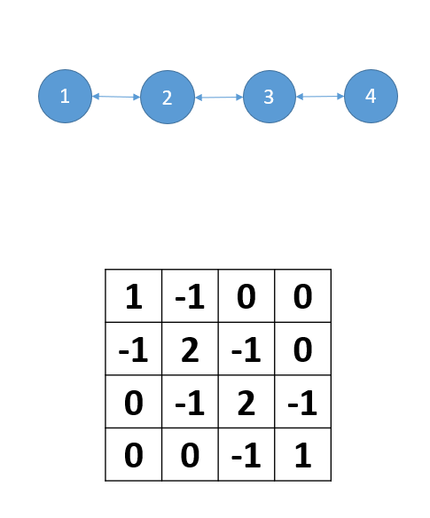
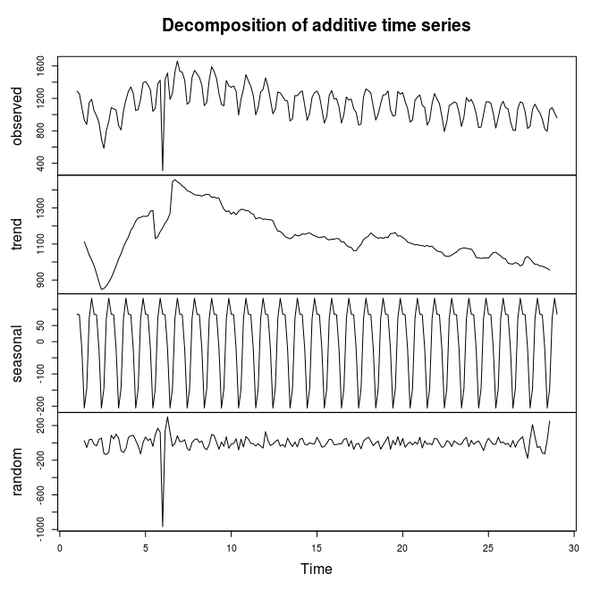

```{r setup, include=FALSE}
knitr::opts_chunk$set(echo = FALSE)
#knitr::opts_knit$set(root.dir = usethis::proj_path())

library('here')
library('sf')
library('mgcv')
library('gratia')
library('gamair')
library('ggplot2')
library('purrr')
library('mvnfast')
library("tibble")
library('gganimate')
library('cowplot')
library('tidyr')
library("knitr")
library("viridis")
library('readr')
library('dplyr')
library('gganimate')
library('transformr')
library('patchwork')
library('splines2')
library('RColorBrewer')
library('rnaturalearth')

opts_chunk$set(cache=TRUE, echo=FALSE)

trawls <- read.csv("../data/trawl_nl.csv")
```


# What did you want to cover?

Top picks:


* Time series analysis and more complex spatiotemporal models

--

* Regression models where slopes vary with covariates, or between grouping levels

--

* Models with zero-inflation and where variance can change as a function of covariates

--

* Modelling proportion data and categorical data

---

# Outline

1. Different types of smoothers:

  * For spatiotemporal data (Markov Random Fields, Gaussian Processes, Cyclic smoothers)

  * Specifying varying coefficient models and hierarchical GAMs

--

2. New families in `mgcv`

  * Zero-inflated Poisson (`ziplss`) and Location-Scale models (`twlss`)

  * `betar` for proportions, `ocat` for ordered categorical data
  
---

class: inverse middle center subsection

# Part 1: Smoothers for complex data


---

# Refresher:

A smoother consists of:

1. a set of basis functions, $f_1(x_1)$, $f_2(x_2)$, $f_3(x_3)$, . . .

2. linear coefficients for those basis functions $\beta_1$, $\beta_2$, $\beta_3$

3. A penalty matrix that describes how strongly different combinations of those basis functions are penalized: $\mathbf{\beta}'\mathbf{S}\mathbf{\beta}$.

--

Different smoothers penalize different shapes of smooth function; what smooth you use will depend heavily on how wiggly you expect the underlying function to be

---

```{r basic_smooth, fig.width=12}

```

--

.pull-left[


```{r mrf_smooth1, fig.width=6}

```

]

--

.pull-right[


```{r cyclic_smooth, fig.width=6}

```

]

---
class: middle

# Markov Random fields (MRFs)

.pull-left[ 
* MRFs are smoothers for *networks*

* penalize groups that are connected toward one another
]


.pull-right[ 
```{r mrf-line}

```
]

---
class: middle

.pull-left[ 
 MRFs are especially useful for modelling patchy landscapes and complex coastlines
 
]

.pull-right[
```{r mrf-grid}

```
]


---

.left-column[ 
 MRFs are especially useful for modelling patchy landscapes and complex coastlines
 
]

.right-column[
```{r trawl-map, echo=FALSE, include= TRUE,message=FALSE, warning=FALSE}


trawl_map <- st_read("../data/all_strata.shp",quiet = TRUE)


nl_coast <- ne_coastline(scale = 50,returnclass = "sf") %>%
  st_transform(st_crs(trawl_map))%>%
  st_intersection(st_as_sfc(st_bbox(trawl_map) ))

ggplot(trawl_map)+
  geom_sf(fill = NA)+
  geom_sf(data = nl_coast, color= "red")+
  theme_bw()

```

]


---

# It is possible to approximate an MRF with fewer basis functions

```{r mrf-basis, include=TRUE, echo = FALSE,eval=TRUE, fig.width = 14,fig.height=8,message =FALSE, warning = FALSE}


# load strata shapefile
strata <- read_sf("../data/trawl_strata.shp",quiet = TRUE)%>%
  mutate(stratum = factor(stratum))%>%
  group_by(stratum)%>%
  summarize()

strata_merge <- strata %>%
  st_buffer(dist = .01)%>%
  summarize()

# for mgcv, we want a penalty matrix, taking into account neighbourhoods
nl_strata_penalty <- strata %>%
  st_buffer(dist = 0.01)%>%
  st_intersects(sparse= FALSE) 


nl_strata_penalty <- -nl_strata_penalty
diag(nl_strata_penalty) <- -(rowSums(nl_strata_penalty)- diag(nl_strata_penalty))


strata_mrf <- smooth.construct(s(stratum, bs="mrf", k = 8, xt = list(penalty = nl_strata_penalty)),data=strata,knots = NULL)

basis_map <- strata %>%
  bind_cols(as_tibble(strata_mrf$X)) %>%
  gather(key = `basis function`, value = value,V1:V8)%>%
  ggplot() +
  geom_sf(data = nl_coast, color= "red")+
  facet_wrap(~`basis function`,nrow = 2)+
  geom_sf(aes(fill= value),color =NA)+
  geom_sf(data=strata_merge,fill =NA)+
  scale_fill_gradient2(low="blue",high="red")+
  theme_minimal()

basis_map

```

---

# Using GAMs for time series

.pull-left[

The wide range of smoothers available makes GAMs very useful for time series data 


We often want to break a time series apart into components: the trend, seasonal effects, and noise
]

--


.pull-right[
```{r }


```
]
---

# GAMs let us decompose time series easily


```{r include= TRUE, echo = TRUE, eval = TRUE, fig.width=12,fig.height=4.5,warning=FALSE,message= FALSE}
nottem_temp <- nottem %>%
  as_tibble() %>%
  mutate(year = rep(1920:1939, each = 12),
         month = rep(1:12, times = 20))%>%
  rename(temperature = x)

ggplot(nottem_temp, aes(x = year+(month-1)/12, y= temperature))+
  geom_line()+labs(x="year") +theme_bw()

```

---
# GAMs let us decompose time series easily


```{r include= TRUE, echo = TRUE, eval = TRUE, fig.width=12,fig.height=6}
nottem_temp_model <- gam(temperature ~ s(year,k = 20, bs="tp") +
                           s(month, bs= "cc", k= 12),
                         knots = list(month= c(0,12)),
                         data=nottem_temp)
draw(nottem_temp_model)

```

---

# GAMs let us decompose time series easily


* Trend model can be any smooth term (thin plate, MRF, random effect, etc.), can include missing years / irregularly sampled data

--

* Possible to include seasonal effects that change over time using tensor-products

--

* It is also possible to add a model for the error (i.e. short-term variation) using gamm, but it should be used with caution:

```{r include= TRUE, echo = TRUE, eval = FALSE, fig.width=12,fig.height=6}
nottem_temp_autocor_model <- gamm(temperature ~ s(year,k = 20, bs="tp") +
                           s(month, bs= "cc", k= 12),
                         knots = list(month= c(0,12)),
                         correlation = corAR1(form = ~ month|year),
                         data=nottem_temp)

summary(nottem_temp_autocor_model$lme)
```
---
```{r include= TRUE, echo = FALSE, eval = TRUE}
nottem_temp_autocor_model <- gamm(temperature ~ s(year,k = 20, bs="tp") +
                           s(month, bs= "cc", k= 12),
                         knots = list(month= c(0,12)),
                         correlation = corAR1(form = ~ month|year),
                         data=nottem_temp)

summary(nottem_temp_autocor_model$lme)
```


---

# GAMs also allow for relationships to vary with other predictors

 $link(\mu_i) = f_1(x_1)\cdot x_2$

--

Specified in `mgcv` using the `by=x2` argument in the `s()/te()/ti()/t2()` functions:

```{r eval=FALSE, echo = TRUE}

gam(y ~ s(x1, by = x2), ...)

```

--


If `x2` is continuous, this fits a varying slope model

If `x2` is discrete, fits a separate function (with its own penalty) for each group level 

--

**This is really important**: `mgcv` will not warn you if you accidentally use a continuous variable when you mean to use a discrete one (or vice versa)!

---

# Hierarchical GAMs: 

* It is also possible to create group-level smoothers where each group has its own functional shape,  but all curves are similiarly smooth

--

* Benefit: fewer smoothing parameters, share information between group levels on smoothness

--

* The `fs` (factor-smooth) basis is set up in `mgcv` to do this for 1D or 2D smoothers; you can use `te()` or `t2()` functions with group-level random effects for higher dimensional smoothers (see Pedersen et al. 2018 for more details)


---


class: inverse middle center subsection


# Enough slides; let's code!


---

class: inverse middle center subsection

# Part 2: Families for modelling different types of data

---

#Key issues for choosing a distribution

The choice of distribution depends heavily on your modelling goals. However, there are general guidelines for choosing an appropriate distribution:

--

*1. The distribution should respect the limits of the data* (continuous vs. discrete, bounded above or below, summing to some constant)

--

*2. Test how well a given distribution fits the data*:  it is always a good idea to hold some data back for testing before fitting any models, and simulating what your data should look like using the chosen distribution.

--

*3. All else equal, a simpler distribution (with fewer free parameters) is likely going to make more robust predictions *

---


# Proportion data

* One type of data that can frequently come up in ecological problems are *proportions*, where all that you have for observations are the fraction of some value between zero and one
 
--
 
 
* Unlike with *binomial* or categorical data, these measurements are not typically counts, but instead continuous measurements

--

* examples:

  * Percentage cover of plants or benthic invertebrates in a plot
  * Relative dominance of some key species in a community
  * Percentage of a stomach filled with food

---
class: center

# Modelling proportions: the beta distribution


```{r beta-dist}
shape1 <- c(0.2, 1, 5, 1, 3, 1.5)
shape2 <- c(0.2, 3, 1, 1, 1.5, 3)
x <- seq(0.01, 0.99, length = 200)
rr <- brewer.pal(length(shape1), "Dark2")
fymat <- mapply(dbeta, shape1, shape2, MoreArgs = list(x = x))
matplot(x, fymat, type = "l", col = rr, lwd = 2, lty = "solid")
legend("top", bty = "n",
       legend = expression(alpha == 0.2 ~~ beta == 0.2,
                           alpha == 1.0 ~~ beta == 3.0,
                           alpha == 5.0 ~~ beta == 1.0,
                           alpha == 1.0 ~~ beta == 1.0,
                           alpha == 3.0 ~~ beta == 1.5,
                           alpha == 1.5 ~~ beta == 3.0),
       col = rr, cex = 1.25, lty = "solid", lwd = 2)
```

---

# betar family in mgcv

The beta distribution is implemented in mgcv using the `"betar"` family 

Key features:

* Default link is "logit" (other options available)

* Bounded between zero and one (with corrections to account for data exactly equal to zero and one) 


--

```{r shrimp_beta, echo = TRUE, include = TRUE, eval =TRUE}
shrimp_frac_model <- gam(shrimp/total ~ s(x,y,k=50) + s(year,k=10),
                         data = trawls,
                         method = "REML",
                         family  = betar)
```


---
```{r shrimp_beta2, echo = TRUE, include = TRUE, eval =TRUE, fig.width=12,warning=FALSE}
draw(shrimp_frac_model)
```


---

# Families with multiple smoothed parameters

We have focused so far on models with only a single modelled outcome for each covariate combination: the mean value.

It is also possible to model other components of the distribution, though:

  * Changing variance or scale parameters - **Location-scale-shape families**
  * The likelihood of a zero value for zero-inflated data: **Zero-inflated families**
  * The probability of detecting different categories in a location: **categorical models**

---

In general, these models look like:


$y_i \sim \text{some distribution}(\alpha_i, \beta_i, ...)$

$link_{\alpha}(\alpha_i) = f_{\alpha,1}(x_1) + f_{\alpha,2}(x_2) ...$

$link_{\beta}(\beta_i) = f_{\beta,1}(x_1) + f_{\beta,2}(x_2) ...$


--

**For Zero-inflated data: ** $\alpha$ = probability of observing a zero, $\beta$ mean conditional on not being a zero

**For location-scale models:** $\alpha$ = the mean value, $\beta$ = the shape parameter

**For multinomial models:** $\alpha,\beta,etc.$ = the odds of observing a given category relative to a baseline category


---

# These are specified as lists of functions in R:

--

```{r shrimp_lss, echo = TRUE, include = TRUE, eval =TRUE}
shrimp_lss_model <- gam(list(
  shrimp ~ s(x,y,k=50) + s(year,k=10),
  ~ 1,
  ~ s(x,y,k=10) + s(year, k=10)),
                         data = trawls,
                         method = "REML",
                         family  = twlss)
```

--
Remember for Tweedie: $\text{Var}\left(\text{value}\right) = \phi\mathbb{E}(\text{value})^q$

Modelled parameters in the list are: 

1. The mean value ( $\mathbb{E}(\text{value})$ )
2. The power $p$
3. The scale parameter

---


```{r shrimp_lss2, echo = TRUE, include = TRUE, eval =TRUE,warning=FALSE, fig.width= 15,fig.height=8}
draw(shrimp_lss_model)
```

---

class: inverse middle center subsection


#To the code!
